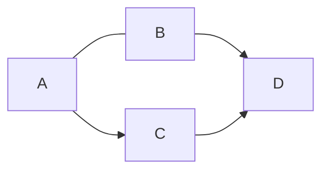
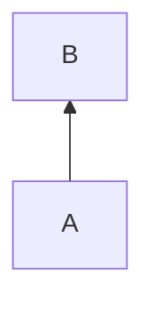

<!--
#   Mermaid and SMILES
-->

<!-- #T# Table of contents -->

<!-- #C# Mermaid -->
<!-- #C# - Styling -->
<!-- #C# -| Themes -->
<!-- #C# SMILES -->

<!-- #T# Beginning of content -->

<!-- #C# Mermaid -->

<!-- # |------------------------------------------------------------- -->
<!-- #T# Mermaid is used in Markdown to create diagrams such as graphs, pie charts, Gantt diagram, flowcharts, class diagrams, entity relationship diagrams, etcetera -->

<!-- #T# Pandoc can be used to render Mermaid diagrams in HTML and PDF files, this needs the use of an external Pandoc filter, such as the `mermaid-filter` filter -->

<!-- #T# to use Mermaid in Markdown, the code block is used, using the word 'mermaid' as the language of the code block -->

<!-- #T# the first word after mermaid is , this word determines the type of diagram, 'graph' is to make flowcharts, it can also be 'pie' for a pie chart, 'gantt' for a Gantt diagram, 'stateDiagram' for a state diagram, 'classDiagram' for a class diagram, 'erDiagram' for an entity relationship diagram, 'sequenceDiagram' for a sequence diagram, each with its own syntax -->

<!-- #T# Mermaid code can be written in its own file, and it can be compiled into SVG using the `mmdc` command, which is the Mermaid CLI -->

<!-- #T# the `mmdc` command has the following basic syntax -->
<!-- # SYNTAX `mmdc -i input_file1.mmd -o output_file1.svg`{.bash} -->
<!-- #T# the file output_file1.svg contains the image form of the Mermaid diagram in input_file1.mmd -->

<!-- #T# to put a caption to the image, the `caption` attribute can be used. The format attribute sets the format of the image, it can be 'svg', 'png' -->
``` {.mermaid caption="image_caption1" format="svg"}
graph TB
    A-->B
```

<!-- #T# in a 'graph' diagram, LR stands for left to right, but it can be replaced with TB which stands for top to bottom, these letters can be reversed, RL stands for right to left, and BT stands for bottom to top. TD is a synonym for TB, but there is no DT counterpart -->


<!-- #T# in the syntax `A---B`, A and B are nodes, nodes can have any name but not the name 'end' -->

<!-- #T# the general syntax for nodes is -->

<!-- # SYNTAX identifier1open_delimiter1 string1 close_delimiter1 -->

<!-- #T# identifier1 is a string that identifies the node. string1 is a string with the contents that are displayed in the diagram, string1 is optional, if left out then identifier1 is displayed in the diagram -->

<!-- #T# the pair open_delimiter1 and close_delimiter1 is a pair of corresponding delimiters, they can be '[string1]' for a rectangle, '(string1)' for a rectangle with rounded corners, '([string1])' for a rectangle with rounded horizontal edges, '[[string1]]' for a flowchart subroutine shape, '[(string1)]' for a flowchart database shape, '((string1))' for a circle, '>string1]' for a five side shape, '{string1}' for a square rhombus, '{{string1}}' for a hexagon, '[/string1/]' for a slanted right parallelogram, '[\string1\]' for a slanted left parallelogram, '[/string1\]' for an upwards trapezoid, '[\string1/]' for a downwards trapezoid -->

<!-- #T# note that identifier1open_delimiter1 has no space between identifier1 and open_delimiter1 -->

<!-- #T# string1 can be placed inside double quoted, to be able to used delimiters as characters that are part of the string, for example "text (text) text" -->

<!-- #T# node1 abbreviates identifier1open_delimiter1string1close_delimiter1 -->

<!-- #T# nodes can be connected in different ways with this syntax -->

<!-- # SYNTAX node1 connector1 node2 -->

<!-- #T# node1 and node2 are nodes as shown before. connector1 can be, '-->' for an arrow from node1 to node2, '---' for a line from node1 to node2, '-.-' for a dotted line, '-.->' for a dotted arrow, '==>' for a thick arrow -->

<!-- #T# connector1 can have text inside, it can be '-- string1 -->' for an arrow with text, '-- string1 ---' for a line with text, '-. string1 .-' for a dotted line with text, '-. string1 .->' for a dotted arrow with text, '== string1 ==>' for a thick arrow with text -->

<!-- #T# several nodes can be connected in chain -->
<!-- # SYNTAX node1 connector1 node2 connector2 node3 -->
<!-- #T# more nodes and connectors can be placed like this -->
graph TB
  A --> B --> C[End node]

<!-- #T# the & operator means 'and', it's used to put nodes on the same hierarchical level -->
graph TB
  A & B --> C
<!-- #T# A and B are placed on the same hierarchical level, above C -->

<!-- #T# two nodes are separated by a single hierarchical level by default. To separate two nodes further, the arrow length is increased. Each character that the arrow length is increased corresponds to one additional hierarchical level separating the nodes. In arrows with text, the arrow length is increased in the end side of the arrow -->
graph TB
  A --> D
  B ====> D
  C -. text ....-> D
<!-- #T# B is plus two hierarchical levels above D, C is plus three hierarchical levels above D -->

<!-- #T# nested graphs can be created with this syntax -->

<!-- # SYNTAX nested graphs    -->
<!-- # subgraph subgraph_id1   -->
<!-- #   nodes_and_connectors1 -->
<!-- # end                     -->

graph TB
  A --> B
  A --> C
    subgraph sub1
      C --> D
      subgraph sub_sub1
        D --> E
      end
    end

<!-- #T# using 'flowchart' instead of 'graph' for the type of diagram has the same features and a few more -->

<!-- #T# bidirectional arrows can be created -->
flowchart TB
  A <--> B
  C <-.-> D
  E <==> F

<!-- #T# different flowcharts con be connected to each other, by creating each flowchart as a subgraph and then connecting the subgraphs as regular nodes -->

<!-- # SYNTAX creating a subgraph -->
<!-- # subgraph subgraph_id1 ["subgraph string1"] -->
<!-- #   node1 connector1 node2 -->
<!-- # end -->

<!-- #T# "subgraph string1" appears as the name of the subgraph, it is optional, if omitted then subgraph_id1 is shown as the name of the subgraph -->

flowchart LR
  subgraph First
    A --> B
  end
  subgraph Second
    C --> D
  end
  First --> Second

<!-- #T# to ensure that a given order of the nodes is followed, each subsequent node must be placed in a subgraph, this maintains the layout -->
flowchart LR
  node1
  subgraph sub1
    node1 --> node2
    subgraph sub2
      node2 --> node3
    end
  end
  node3 --> node1

## Class diagrams

Class diagrams are created in Mermaid using the `classDiagram` keyword.

``` {.mermaid .syntax}
classDiagram
  diagram_elements1
```

The main elements of a class diagram are: classes and their connections.


----

Create a class by using the `class` keyword.

``` {.mermaid .syntax}
class class1
```


----

Create two classes by connecting their names.

``` {.mermaid .syntax}
class1 --> class2
```

`class1` and `class2` are created as classes, no need to use the `class` keyword.


----

Create members of a class by enclosing them in braces. Notice that the opening brace must be on the same line as the `class` keyword.

``` {.mermaid .syntax}
class class1 {
  type1 attribute1
  method1(args1) ret_type1
}
```


----

Create members of a class individually.

``` {.mermaid .syntax}
class class1
class1 : type1 attribute1
class1 : method1(args1) ret_type1
```


----

The visibility or access modifier of a member, can be set as the first symbol of a member. `+` means a public member, `#` means a protected member, `~` means a package member, and `-` means a private member.

``` {.mermaid .syntax}
class class1 {
  +type1 member1
  #type2 member2
}
class1 : ~type3 member3
class1 : -type4 member4
```


----

A method can be made abstract *, or static $ (the symbol is placed after the parentheses of the method).

``` {.mermaid .syntax}
class class1 {
  abstract_method1(args1)* ret_type1
  static_method1(args1)$ ret_type1
}
```


----

Templates or generic types can be created by enclosing the generic type within tildes.

``` {.mermaid .syntax}
class class1~template_class1~
class1 : -List~type1~ container1
```


----

A relationship between two classes can be created with the following syntax.

``` {.mermaid .syntax}
class1 relationship1 class2 : relationship_label1
```

`relationship1` is an arrow representing the relationship between `class1` and `class2`. `relationship_label1` is a label placed on the arrow. The following shows the possible values of `relationship1`.

``` {.mermaid in="in file1.mmd"}
classDiagram
  class1 --|> class2 : Inheritance
  class3 --* class4 : Composition
  class5 --o class6 : Aggregation
  class7 --> class8 : Association
  class9 -- class10 : Association
  class11 ..> class12 : Dependency
  class13 .. class14 : Dependency
  class15 ..|> class16 : Realization
```


----

A class can have multiple instances of another class. This multiplicity or cardinality can be set with the following syntax.

``` {.mermaid .syntax}
class1 "multiplicity1" relationship1 "multiplicity2" class2
```

`"multiplicity1"` and `"multiplicity2"`, are placed as strings that represent the multiplicities (they should be written as regular UML, but they can be written as almost any desired string, except for values like "none").

For example:

``` {.mermaid .syntax}
class1 "only one" --> "1..*" class2
```

This means that there is "only one" instance of `class1` per instance of `class2`, and there is "1..*" (one to many) instances of `class2` per instance of `class1`.


----

To specify different kinds of classes, like abstract classes and interfaces, an annotation is used. The annotation of a class is placed within double angular brackets.

``` {.mermaid .syntax}
class class1 {
  <<class_annotation1>>
}
```

<!-- #C# - Styling -->

<!-- # |----- -->
<!-- #T# connectors and nodes can be styled, using SVG property value pairs -->

<!-- #T# to style connectors, their number of creation is used, which is the sequential number in which they appear in the graph definition -->

<!-- #T# the following syntax is used to style connectors -->
<!-- # SYNTAX linkStyle int1 property1 : value1, propertyN : valueN -->
<!-- #T# int1 is the number of creation of the link being styled, counting from 0, property1 and value1 are an SVG property value pair -->

graph TB
  A -- link 0 --> B -- link 1 --> C
  B -- link 2 --> D

linkStyle 2 stroke : green,  stroke-width : 6px

<!-- #T# to style nodes, their id is used, with the following syntax -->
<!-- # SYNTAX style id1 property1 : value1, propertyN : valueN -->

graph TB
  A[text] --> B[text]

style A fill : magenta, stroke-dasharray : 10 5

<!-- #T# a default style can be applied by writing 'default' as the link or node being styled -->
<!-- # SYNTAX linkStyle default property1 : value1, propertyN : valueN -->
<!-- # SYNTAX style default property1 : value1, propertyN : valueN -->

<!-- #T# classes can be created to apply style to all nodes of that class, with the following syntax -->
<!-- # SYNTAX classDef class1 property1 : value1, propertyN : valueN -->

<!-- #T# a class is assigned to a set of nodes with the following syntaxes -->
<!-- # SYNTAX class node_id1,node_id2 class1 -->
<!-- # SYNTAX node_id1:::class1 connector1 node2 -->

<!-- #T# the second syntax allows the assignment of class1 to node1 as part of the graph definition -->

graph TB
  A:::class1 --> B

classDef class1 fill : green

<!-- #C# -| Themes -->

<!-- # |- -->
<!-- #T# Themes define the style of each part of a diagram. Themes can be modified -->

<!-- #T# When using the `mermaid-filter` filter to generate Mermaid diagrams in Pandoc, themes can be modified by using a JSON file called `.mermaid-config.json` located in the same directory where the `pandoc` command is executed -->

<!-- #T# In this JSON file, the theme is defined with this syntax -->
<!-- # SYNTAX { "theme": theme1, "themeVariables": { key_vals1 } } -->
<!-- #T# theme1 is the theme being modified, it can be "base" (it's the default theme) -->
<!-- #T# key_vals1 is a set of JSON key value pairs with Mermaid theme variables -->

<!-- #T# The Mermaid theme variables are -->
<!-- #T#     primaryColor, is a CSS color value that sets the background color of the nodes in the diagram, it sets the background color of primary nodes -->
<!-- #T#     secondaryColor, is a CSS color value that sets the background color of secondary nodes -->
<!-- #T#     tertiaryColor, is a CSS color value that sets the background color of subgraphs, it sets the background color of tertiary nodes -->
<!-- #T#     fontFamily, is a string with the name of an installed or available font family -->
<!-- #T#     fontSize, is a measure of the font size, accepted units of measure are 'px' for pixel, 'pt' for points -->
<!-- #T#     primaryBorderColor, is a CSS color value that sets the border color of the nodes in the diagram. It sets the border color of primary nodes -->
<!-- #T#     primaryTextColor, is a CSS color value that sets the text color of the nodes in the diagram. It sets the text color of primary nodes -->
<!-- #T#     secondaryBorderColor, is a CSS color value that sets the border color of secondary nodes -->
<!-- #T#     secondaryTextColor, is a CSS color value that sets the text color of secondary nodes -->
<!-- #T#     tertiaryBorderColor, is a CSS color value that sets the border color of subgraphs. It sets the border color of tertiary nodes -->
<!-- #T#     tertiaryTextColor, is a CSS color value that sets the text color of subgraphs. It sets the text color of tertiary nodes -->
<!-- #T#     lineColor, is a CSS color value that sets the color of connectors -->

<!-- #T# there is a number of theme variables specific for flowcharts -->
<!-- #T#     nodeBorder, same as primaryBorderColor -->
<!-- #T#     nodeTextColor, same as primaryTextColor -->
<!-- #T#     clusterBkg, same as tertiaryColor -->
<!-- #T#     clusterBorder, same as tertiaryBorderColor -->
<!-- #T#     defaultLinkColor, same as lineColor -->
<!-- #T#     titleColor, same as tertiaryTextColor -->

``` json
{ "theme": "base", "themeVariables": { "primaryColor": "#F00", "tertiaryColor": "#0F0", "fontFamily": "Arial", "fontSize": "16pt" } }
```

<!-- # |- -->

<!-- # |----- -->

<!-- # |------------------------------------------------------------- -->

<!-- #C# SMILES -->

<!-- # |------------------------------------------------------------- -->
<!-- #T# SMILES stands for Simplified Molecular Input Line Entry System, it is used in Markdown to convert plain text into 2D molecular diagrams -->

<!-- #T# to use SMILES in Markdown, a code block is used, using the word 'smiles' as the language of the code block (it may require a Mathpix SMILES extension or compiler to see the molecule) -->
```smiles
O=C=O
```
<!-- #T# this shows a carbon dioxide molecule -->
<!-- # |------------------------------------------------------------- -->