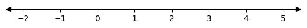

#   Whole numbers (Números enteros)

## Introduction (Introducción)
[Ch01_S01](../../../Libros/Mathematics/Algebra_basics__Prealgebra__OpenStax.pdf#page=15)

(Números naturales)
**Counting numbers**: these are, 1, 2, 3, 4, ...

(Recta real)
**Number line**



(Origen)
**Origin**: this is the point at 0.

(Coordenada de un punto)
**Coordinate of a point**: this is the number, or numbers, tied to the point.

(Números naturales y el cero)
**Whole numbers**: these are, 0, 1, 2, 3, 4, ...

(Sistema de numeración posicional)
**Place value system**: system in which the value of a digit depends on its place in the number.

(Grupos en la numeración posicional)
**Plave value periods**: these periods are the separation of digits in groups of three, each has a name, ones, thousands, millions, etc.

(Redondeo)
**Rounding**: approximating a number with another of less significant digits.

```Python
#T# The round function rounds to the nearest even
num1 = round(1.5) # 2
num1 = round(2.5) # 2
num1 = round(23658, -2) # 23700
num1 = round(23650, -2) # 23600
```

## Addition (Adición)
[Ch01_S02](../../../Libros/Mathematics/Algebra_basics__Prealgebra__OpenStax.pdf#page=32)

Addition is the operation of adding numbers together.

(Operador suma)
**Sum operator**: this operator is $+$, the plus sign.

(Notación de la suma)
**Addition notation**: the addition of $a, b$ is $a + b$, read as $a$ plus $b$ ($a$ más $b$), $a, b$ are called the addends (sumandos), the result is called the sum (suma).

(Enunciado matemático)
**Math statement**: any math writing that can be read as a statement, with symbols, signs, numbers, operators, etc.

(Expresión)
**Expression**: a statement of numbers, symbols, and operations together, such as $a + b + c$.

(Signo de igualdad)
**Equality sign**: this sign is $=$, the equal sign.

(Ecuación)
**Equation**: the statement of two expressions that are equal, such as $a + b = c + d$.

(Propiedad de identidad de la suma)
**Identity property of addition**: adding to zero doesn't change the number, $a + 0 = a$.

(Identidad aditiva)
**Additive identity**: The number 0.

(Propiedad conmutativa de la suma)
**Commutative property of addition**: changing the addends' order doesn't change the sum, $a + b = b + a$.

Example: $2 + 2 = 4$

## Subtraction (Sustracción)
[Ch01_S03](../../../Libros/Mathematics/Algebra_basics__Prealgebra__OpenStax.pdf#page=48)

Subtraction is the operation of subtracting a number from another.

(Operador resta)
**Subtraction operator**: this operator is $-$, the minus sign.

(Notación de la resta)
**Subtraction notation**: the subtraction of $a$ from $b$ is $b - a$, read as $b$ minus $a$ ($b$ menos $a$), $b$ is called the minuend (minuendo), $a$ is called the subtrahend (sustraendo), the result is called the difference (diferencia). In $b - a = c$, $c$ is the difference.

Addition and subtraction are inverse operations.

Example: $5 - 3 = 2$

## Multiplication (Multiplicación)
[Ch01_S04](../../../Libros/Mathematics/Algebra_basics__Prealgebra__OpenStax.pdf#page=63)

Multiplication is the operation of multiplying numbers together, this means the repeated addition of a number with itself, the amount of repetitions is the other number in the operation.

(Operador multiplicación)
**Multiplication operator**: this operator is $\times$, the times sign. Another is $\cdot$, the dot sign. Another is $()$, the parentheses signs.

(Notación de la multiplicación)
**Multiplication notation**: the multiplication of $a, b$ is $a \times b$, read as $a$ times $b$ ($a$ veces $b$), $a$, $b$ are called the factors (factores), the result is called the product (producto). In $a \times b = c$, $c$ is the product.

(Propiedad anulativa de la multiplicación)
**Multiplication property of zero**: the product of any number multiplied by 0, is 0, $a \times 0 = 0$

(Propiedad modulativa de la multiplicación)
**Identity property of multiplication**: the product of any number multiplied by 1, is the number itself, $a \times 1 = a$

(Identidad multiplicativa | elemento neutro | elemento identidad)
**Multiplicative identity**: The number 1.

(Propiedad conmutativa de la multiplicación)
**Commutative property of multiplication**: changing the factors' order doesn't change the product, $a \times b = b \times a$

Example: $4 \times 3 = 3 + 3 + 3 + 3 = 12$

## Division (División)
[Ch01_S05](../../../Libros/Mathematics/Algebra_basics__Prealgebra__OpenStax.pdf#page=81)

Division is the operation of dividing a first number by a second one, this means the repeated subtraction of the second number from the first one, the amount of repetitions is the result of the operation.

(Operador división)
**Division operator**: this operator is $\div$, the division sign. Another is $/$, the slash sign. Another is $\text{---}$, the horizontal line sign.

(Notación de la división)
**Division notation**: the division of $b$ by $a$ is $b/a$, read as $b$ divided by $a$ ($b$ dividido $a$), $b$ is called the dividend (dividendo), $a$ is called the divisor (divisor), the result is called the quotient (cociente). In $b/a = c$, $c$ is the quotient.

(Propiedad modulativa de la división)
**Identity property of division**: the quotient of any number divided by 1, is the number itself, $a/1 = a$

(Identidad divisiva)
**Divisive identity**: The number 1.

(Propiedad del cociente uno de la división)
**Division property of quotient one**: any non zero number divided by itself gives a quotient of 1, $a/a = 1$.

(Propiedades del cero en la división)
**Division properties of zero**: zero divided by any number is zero, $0/a = 0$. Division by zero is undefined, $a/0$ is undefined.

(Residuo)
**Remainder**: this is the number that is left over after doing the repeated subtraction, let the quotient be $q$, and the remainder be $r$, so $a/b = q + r/b$

Multiplication and division are inverse operations.

Example: $28/8 = 3 + 4/8$