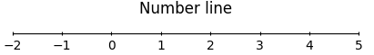

#   Whole numbers (Números enteros)

## Introduction (Introducción)

(Números naturales)
Counting numbers are 1, 2, 3, 4, ...

(Recta real)
Number line

## Addition (Adición)

## Subtraction (Sustracción)

## Multiplication (Multiplicación)

## Division (División)

