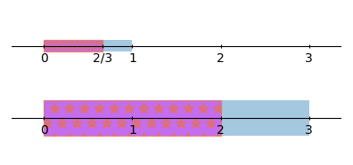

#   Fractions (Fracciones)

<!--
#T# Table of contents

#C# Introduction to integers (Introducción a los enteros)
#C# Addition of integers (Adición de enteros)
#C# Subtraction of integers (Sustracción de enteros)
#C# Multiplication and division of integers (Multiplicación y división de enteros)
#C# Solution of an equation with integers, multiplication and division properties of equality (Soluciones de una ecuación con enteros, propiedades multiplicativa y divisiva de la igualdad)

#T# Beginning of content
-->

## Visualizing fractions (Visualizando fracciones)
[Ch04_S01](../../../Libros/Mathematics/Algebra_basics__Prealgebra__OpenStax.pdf#page=281)

(Fracciones)
**Fractions**: numbers that represent a part of a whole number or an integer, so there are many fractions between any two integers. This set of numbers also forms an ordered set in which the relational operators can be used to compare the values of two fractions.

(Notación de las fracciones)
**Fraction notation**: given that fractions are numbers that can be between two integers, they are represented with a division, a fraction that is not integer has a remainder different from 0 when represented as a division. The fraction $\frac{a}{b}$ is calculated as $a$ divided by $b$, with $b$ being nonzero.
[Fraction notation code](Programs/Ch04/S01_01_Fraction_notation.py)

For example, $\frac{2}{3}$ means $2$ divided by $3$, and using the definition of division, this calculates the amount of times that the number $3$ is subtracted from $2$ until 0 is reached, but subtracting $3$ from $2$ gives $-1$ because $2 - 3 = -1$, so to reach 0, a proportion, fraction, or part of $3$ must be subtracted from $2$, and not the full unity of the number $3$. 

By the definition of division, $\frac{2}{3}$ is the amount of times that $3$ is subtracted from $2$ to reach 0. This amount, $\frac{2}{3}$ is between $0$ and $1$ and it occupies the same proportional distance to $1$, as the number $2$ occupies to $3$, as shown in the figure.
[Fraction diagram image code](Programs/Ch04/S01_02_Fraction_diagram_image.py)

*Fraction diagram*

(Numerador y denominador)
**Numerator and denominator**: the numbers in a fraction, the numerator is the number on top (called dividend in the division operation), and the denominator is the number at the bottom (called divisor in the division operation). For example, in $\frac{a}{b}$ $a$ is the numerator and $b$ is the denominator.

(Propiedad del 1 en la división)
**Division property of 1**: any non zero number divided by itself is 1.

> Division property of 1
>
> Let $a$ be a nonzero number, then
> $$\frac{a}{a} = 1$$

(Fracciones propias)
**Proper fractions**: a fraction $\frac{a}{b}$ in which $a < b$. A proper fraction is always between 0 and 1.

(Fracciones impropias)
**Improper fractions**: a fraction $\frac{a}{b}$ in which $a \ge b$. An improper fraction can be an integer (when $a$ is a multiple of $b$), and it is always greater than or equal to 1, which means that an improper fraction has an integer part and a proper fraction part, when said parts are added the result is the improper fraction.
[Improper fractions code](Programs/Ch04/S01_03_Improper_fractions.py)

(Números mixtos)
**Mixed numbers**: the representation of an improper fraction as an integer part and a proper fraction part.

> Mixed numbers notation
>
> Let $a$ be an integer, and $\frac{b}{c}$ be a proper fraction, the mixed number they form together is denoted as
> $$a\frac{b}{c}$$

When adding together this numbers, $a + \frac{b}{c}$ the result is an improper fraction with the same value.

(Fracciones equivalentes)
**Equivalent fractions**: fractions that have the same value, even when written with different numbers. Fractions written with different numbers can have the same value because those different numbers can show the same fraction. For example, the fraction $\frac{2}{3}$ is the same as the fraction $\frac{4}{6}$, because the proportional distance that the number $2$ occupies in $3$ is the same as the proportional distance that the number $4$ occupies in $6$. This can be also seen in the figure shown earlier.

(Propiedad de las fracciones equivalentes)
**Equivalent fractions property**: in a given fraction $\frac{a}{b}$, multiplying (or dividing) both the numerator and the denominator by a non zero number $c$, doesn't change the value of the fraction, so $\frac{a}{b} = \frac{a \cdot c}{b \cdot c}$.

## Multiplication and division of fractions (Multiplicación y división de fracciones)
[Ch04_S02](../../../Libros/Mathematics/Algebra_basics__Prealgebra__OpenStax.pdf#page=305)

(Reducir fracciones)
**Reduce fractions**: form of simplification in which a fraction is expressed as an equivalent fraction that has no common factors between the numerator and the denominator. If there is a common factor, both the numerator and the denominator are divided by it, this simplifies the fraction.

For example $\frac{6}{9} = \frac{4}{6}$, but their reduced form is $\frac{2}{3}$. In $\frac{6}{9}$ a common factor is $3$ and dividing the numerator and denominator by $3$ results in $\frac{2}{3}$. In $\frac{4}{6}$ a common factor is $2$ and dividing the numerator and denominator by $2$ results in $\frac{2}{3}$.

The same simplification can be done with variables, e.g. $\frac{2 \cdot x}{x}$ can be simplified to $\frac{2}{1}$ or $2$.

(Fracción irreducible)
**Simplified fraction**: a fraction in which the numerator and the denominator have no common factors.

(Multiplicación de fracciones)
**Fraction multiplication**: the product of two fractions is the product of the numerators over the product of the denominators, $\frac{a}{b} \cdot \frac{c}{d} = \frac{a \cdot c}{b \cdot d}$, this implies two operations, first the multiplication by $c$ and then the division by $d$. Given the PEMDAS order of operations, it's the same if the division by $d$ is done first.

(Recíproco de un número)
**Reciprocal of a number**: another number such that when multipled together the product is 1. In $\frac{a}{b}$, the reciprocal is $\frac{b}{a}$, because $\frac{a}{b} \cdot \frac{b}{a} = \frac{a \cdot b}{b \cdot a} = 1$, and so $a \ne 0$, $b \ne 0$, which means that 0 doesn't have a reciprocal.

Non fraction numbers also have a reciprocal, the reciprocal of $a$ is $\frac{1}{a}$ because $a \cdot \frac{1}{a} = 1$. Using the definition of division, $\frac{1}{a}$ means taking the number $1$ and dividing it into $a$ groups, then $\frac{1}{a}$ is the size of each group, which is the same as the place where the first group ends.

Division by a number is the same as multiplication by its reciprocal, $\frac{a}{b} = a \cdot \frac{1}{b}$, because having $a$ elements divided in $b$ groups, has each group with size $\frac{a}{b}$, and adding $a$ with itself only a fraction $\frac{1}{b}$ times, ends being at the place of $\frac{a}{b}$.

Multiplication by a number is the same as division by its reciprocal, $a \cdot b = a \div \frac{1}{b}$, because it follows the definition of division as repeated subtraction. Starting from $a$, to reach 0 by subtracting $\frac{1}{b}$, it must be done $a \cdot b$ times, this is because to reach 0 by subtracting $1$ it is done $a$ times, $\frac{a}{1} = a$, and to do it by subtracting $\frac{1}{b}$, it must be done $b$ times as much.

(Invertir un número)
**Invert a number**: the process of finding the reciprocal of a number. When a number is inverted the result is its reciprocal.

(División de fracciones)
**Fraction division**: the operation $\frac{a}{b} \div \frac{c}{d}$. This implies two operations, division by $c$ and division by the reciprocal of $d$ which is the same as multiplication by $d$, so $\frac{a}{b} \div \frac{c}{d} = \frac{a \cdot d}{b \cdot c}$.

## Multiplication and division of mixed numbers and complex fractions (Multiplicación y división de números mixtos y fracciones complejas)
[Ch04_S03](../../../Libros/Mathematics/Algebra_basics__Prealgebra__OpenStax.pdf#page=325)

(Multiplicación y división de números mixtos)
**Multiplication and division of mixed numbers**: this operations are done the same as multiplication and division of proper fractions. The mixed numbers should be converted to improper fractions first, as shown earlier.

(Fracciones complejas)
**Complex fractions**: the division of two fractions, $\frac{\frac{a}{b}}{\frac{c}{d}} = \frac{a}{b} \div \frac{c}{d} = \frac{a \cdot d}{b \cdot c}$.

(Simplificación de fracciones complejas)
**Simplification of complex fractions**: complex fractions are simplified like regular fractions.
[Simplification of complex fractions](Programs/Ch04/S03_01_Simplification_of_complex_fractions.py)

(Simplificación de expresiones con fracciones)
**Simplification of expressions with fractions**: expressions with fractions are simplified like regular expressions
[Simplification of expressions with fractions](Programs/Ch04/S03_02_Simplification_of_expressions_with_fractions.py)

(Fracciones negativas)
**Negative fractions**: when either the numerator is negative, or the denominator is negative, the fraction itself is negative, $\frac{-a}{b} = -\frac{a}{b}$, and $\frac{a}{-b} = -\frac{a}{b}$.

## Addition and subtraction of fractions with common denominators (Adición y sustracción de fracciones con denominador común)
[Ch04_S04](../../../Libros/Mathematics/Algebra_basics__Prealgebra__OpenStax.pdf#page=338)

(Adición de fracciones con denominador común)
**Addition of fractions with common denominators**: the same as normal addition. It must be noted that $\frac{a}{b} = \frac{1}{b} \cdot a$, which means that $\frac{a}{b} + \frac{c}{b} = \frac{1}{b} \cdot (a + c) = \frac{a + c}{b}$, because $a$ and $c$ are multiples of $\frac{1}{b}$ which are then added together.

(sustracción de fracciones con denominador común)
**Subtraction of fractions with common denominators**: the same as normal subtraction, and following the logic shown for addition, $\frac{a}{b} - \frac{c}{b} = \frac{a - c}{b}$.

## Addition and subtraction of fractions with different denominators (Adición y sustracción de fracciones con denominador diferente)
[Ch04_S05](../../../Libros/Mathematics/Algebra_basics__Prealgebra__OpenStax.pdf#page=350)

(Mínimo común denominador)
**Least common denominator**: the least common multiple of the denominators from a set of fractions.

(Adición de fracciones con denominador diferente)
**Addition of fractions with different denominators**: first the fractions being added must have common denominators, for this, each fraction is converted to an equivalent fraction such that its denominator is the common one. The common denominator is found as the least common denominator of the fractions. The addition is done like regular addition when the denominators are common.

(Sustracción de fracciones con denominador diferente)
**Subtraction of fractions with different denominator**: like regular subtraction, but first applying the steps in addition of fractions with different denominators, such that the denominators are common.

(Evaluación de expresiones con fracciones)
**Evaluation of expressions with fractions**: like regular evaluation.

## Addition and subtraction of mixed numbers (Adición y sustracción de números mixtos)
[Ch04_S06](../../../Libros/Mathematics/Algebra_basics__Prealgebra__OpenStax.pdf#page=372)

(Adición de números mixtos)
**Addition of mixed numbers**: like regular addition. The integer parts of the mixed numbers can be added directly, and the proper fraction parts are added with the rules of addition of fractions, the result number is the sum of the integer and fraction parts. To show the result as a mixed number, the integer part is left alone, and the fraction part is converted to a proper fraction if necessary, this may change the integer part.

(Sustracción de números mixtos)
**Subtraction of mixed numbers**: like regular subtraction. As with addition, the integer parts are subtracted separately from the fraction parts.

## Solution of an equation with fractions (Solución de una ecuación con fracciones)
[Ch04_S07](../../../Libros/Mathematics/Algebra_basics__Prealgebra__OpenStax.pdf#page=388)

An equation with fractions can have a fraction solution, just like a regular solution.