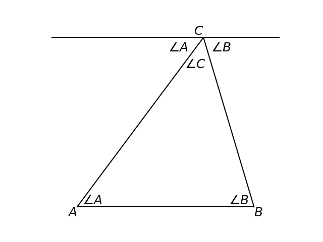
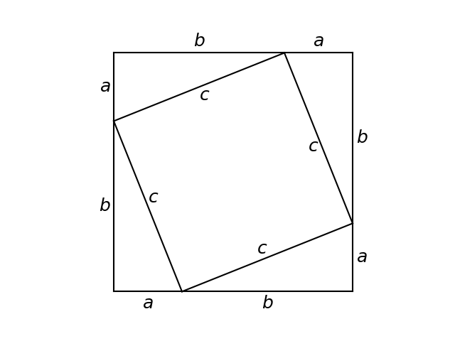

#   Math models and Geometry (Modelos matemáticos y geometría)

## Number problems (Problemas con números)
[Ch09_S01](../../../Libros/Mathematics/Algebra_basics__Prealgebra__OpenStax.pdf#page=727)

Problems with numbers stated as words, for example, there is a number whose product with $3$ is $24$, finding that number gives $8$.

(Números enteros consecutivos)
**Consecutive integers**: integers that follow each other by adding $1$ repeatedly, e.g. $-4$, $-3$, $-2$, or $19$, $20$, $21$, etcetera.

## Combine mixed units (Combinar unidades mixtas)
[Ch09_S02](../../../Libros/Mathematics/Algebra_basics__Prealgebra__OpenStax.pdf#page=742)

Mixed units of measure can be combined together into a single unit. For example, time measured in minutes and seconds can be combined into minutes alone, by adding the seconds divided by $60$ to the minutes.

Money measured in different currency valued coins and bills can be combined together into a single currency value, by converting the total of each type of coin and bill to said currency value and then adding them.

> Combine mixed monetary units
>
> Let $I$ be the set of unique coins and bills with different values, let $i$ be a subindex that indicates a particular element of $I$, let $v_i$ be the value of the coin or bill $i$, let $a_i$ be the amount in possession of the coin or bill $i$, let $V_i$ be the subtotal value of the coin or bill $i$, let $V$ be the total monetary value, then
> $$V_i = a_i \cdot v_i\\
> V = \sum_i{V_i}$$

These formulas can be used to combine mixed units, $V_i$ is the partial value of the coin or bill $i$, and $V$ is the combination of the mixed units into a single unit. The same can be used for problems with tickets or stamps, where there are different types of tickets or stamps, and each with a different value.

## Angles, triangles, pythagorean theorem (Ángulos, triángulos, teorema de Pitágoras)
[Ch09_S03](../../../Libros/Mathematics/Algebra_basics__Prealgebra__OpenStax.pdf#page=755)

(Vértice)
**Vertex**: any point from which one or more lines stem.

(Ángulo)
**Angle**: in two lines that share a vertex, the angle is the measure of rotation of one line with respect to the other.

If a vertex has only two lines, then an angle can be named after said vertex. 

> Angle notation
>
> Let $A$ be a vertex with two lines stemming from it, then $\angle A$ is the angle formed between the two lines, and $m \angle A$ is the measure of said angle.

Angles are commonly measured in degrees and in radians. In degrees a whole rotation that ends at the starting position is measured as $360\degree$ read as $360$ degrees ($360$ grados), and in radians this is measured as $2\pi$ read as $2\pi$ radians ($2\pi$ radianes).

Given those measures, half a whole rotation is $180\degree$ or $\pi$ radians

(Ángulos suplementarios)
**Supplementary angles**: two angles that added together measure $180\degree$ or $\pi$ radians. Each angle in this pair is the supplement (suplemento) of the other.

(Ángulos complementarios)
**Complementary angles**: two angles that added together measure $90\degree$ or $\pi/2$ radians. Each angle in this pair is the complement (complemento) of the other.

(Triángulo)
**Triangle**: shape with three straight sides and therefore three angles. Triangles can be named using the three vertices that form at the intersections of their sides. Each vertex has an opposite side, i.e. the side that does not stem from the vertex.

> Triangle notation
>
> Let $A$, $B$, $C$ be three vertices that form a triangle, then the triangle is denoted as $\triangle ABC$ read as triangle ABC (triángulo ABC). The opposite side (lado opuesto) to each vertex is denoted with a lowercase letter, in this case $a$, $b$, and $c$. The sides can also be noted with the two vertices that form the side, in this case $AB$, $AC$, $BC$.

(Suma de los ángulos de un triángulo)
**Sum of the measures of the angles of a triangle**: the three measures of the angles of any triangle add up to $180\degree$ or $\pi$ radians.

> Sum of the measures of the angles of a triangle
>
> Let $A$, $B$, $C$, be three vertices that form a triangle, then
> $$m \angle A + m \angle B + m \angle C = 180\degree\\
> m \angle A + m \angle B + m \angle C = \pi$$

This is shown in the following figure.
[Triangle angles sum image code](Programs/Ch09/S03_01_Triangle_angles_sum_image.py)

As the figure shows, the straight line that passes through $C$ and is parallel to the side between $A$ and $B$, is composed of the angles $\angle A$, $\angle B$, and $\angle C$, which means that the sum of the three angles in a triangle forms a straight line whose angle is $180\degree$ or $\pi$ radians.

(Ángulo recto)
**Right angle**: a $90\degree$ angle, or $\pi/2$ radians angle.

(Triángulo rectángulo)
**Right triangle**: a triangle in which one of its angles measures $90\degree$ or $\pi/2$ radians, i.e. a triangle with a right angle. The right angle is denoted in the triangle with a square.

Right triangles have three sides, one hypotenuse (hipotenusa) which is the side opposite to the right angle, and two legs (catetos) which are the two sides that stem from the vertex with the right angle.

(Figuras similares)
**Similar figures**: figures that have the same shape but not the same size.

(Figuras congruentes)
**Congruent figures**: figures that have the same shape and also the same size.

(Lados y ángulos correspondientes)
**Corresponding sides and angles**: in similar figures, the sides and angles that would be the same if replacing one figure for the other.

The corresponding sides of two figures have the same ratio, and their corresponding angles have the same value.

Similar triangles are similar figures.

(Teorema de Pitágoras)
**Pythagorean theorem**: in a right triangle, the hypotenuse squared has the same value as the sum of each leg squared.

> Pythagorean theorem
>
> Let $a$, $b$, $c$, be the sides of a right triangle, with $a$ and $b$ being the legs, and $c$ being the hypotenuse, then
> $$c^2 = a^2 + b^2$$

This theorem can be proved with the following image.
[Pythagorean theorem image code](Programs/Ch09/S03_02_Pythagorean_theorem_image.py)

From the image, $(a + b)^2 = c^2 + 2 \cdot a \cdot b$, then $a^2 + 2 \cdot a \cdot b + b^2 = c^2 + 2 \cdot a \cdot b$, and then $a^2 + b^2 = c^2$.

## Rectangles, triangles, trapezoids (Rectángulos, triángulos, trapezoides)
[Ch09_S04](../../../Libros/Mathematics/Algebra_basics__Prealgebra__OpenStax.pdf#page=774)

(Medida lineal)
**Linear measure**: measure for length, like distances, width, height, depth, etcetera, in linear units (unidades lineales).

(Medida cuadrada)
**Square measure**: measure for area size, in square units (unidades cuadradas).

(Medida cúbica)
**Cubic measure**: measure for volume, in cubic units (unidades cúbicas).

(Perímetro)
**Perimeter**: in a two dimensional shape, the measure of the distance around it.

(Área)
**Area**: in a two dimensional shape, the measure of the surface covered by it.

(Cuadrilatero)
**Quadrilateral**: a shape with four straight sides.

(Rectángulo)
**Rectangle**: a quadrilateral with four right angles. This configuration produces a shape in which the opposite sides are of equal length. Its perimeter is equal to the sum of its four sides, and its area is equal to the product of any two adjacent sides.

> Rectangle properties
>
> Let $L$ and $W$ be the lengths of the sides of a rectangle, let $P$ be the perimeter of the rectangle, and $A$ be the area of the rectangle, then
> $$P = 2(L + W)\\
> A = L \cdot W$$

(Propiedades del triángulo)
**Triangle properties**: the perimeter of a triangle is the sum of the lengths of its three sides, the area of a triangle is half the area of the rectangle created with any of the sides of the triangle and that is just big enough to contain the complete triangle.

> Triangle properties
>
> Let $a$, $b$, $c$, be the lengths of the sides of a triangle, let $h$ be the height of the triangle as measured when $b$ is the floor, let $P$ be the perimeter of the triangle, and $A$ be the area of the triangle, then
> $$P = a + b + c\\
> A = \frac{b \cdot h}{2}$$

(Triángulo escaleno)
**Scalene triangle**: a triangle in which all the sides have different measures of length.

(Triángulo isósceles)
**Isosceles triangle**: a triangle in which two of its sides have the same measure of length.

(Triángulo equilatero)
**Equilateral triangle**: a triangle in which all the sides have the same measure of length. All equilateral triangles are similar or congruent.

(Trapezoide)
**Trapezoid**: a quadrilateral with two parallel sides and two non parallel sides. This configuration creates a shape where the two parallel sides are opposite, and also the non parallel sides. 

The two parallel sides in a trapezoid have different sizes, and they are called the bases (las bases), there is a smaller base and a bigger base. The height of a trapezoid is the distance between its bases.

> Trapezoid properties
>
> Let $b$ be the length of the smaller base in a trapezoid, let $B$ be the length of the bigger base in a trapezoid, let $h$ be the height of a trapezoid, let $A$ be the area of a trapezoid, then
> $$A = \frac{1}{2}h(b + B)$$

The area of a trapezoid can be understood with the following image.
[Trapezoid area image code](Programs/Ch09/S04_01_Trapezoid_area_image.py)

As shown in the image, the area of the trapezoid $A$ is equal to the sum of the areas $A_1$ and $A_2$. In turn, each of these areas is the area of a triangle, $A_1 = \frac{b \cdot h}{2}$ and $A_2 = \frac{B \cdot h}{2}$, then $A = A_1 + A_2 = \frac{b \cdot h + B \cdot h}{2} = \frac{1}{2}h(b + B)$.

## Circles and irregular figures (Círculos y figuras irregulares)
[Ch09_S05](../../../Libros/Mathematics/Algebra_basics__Prealgebra__OpenStax.pdf#page=803)

## Volume, surface area (Volumen, área superficial)
[Ch09_S06](../../../Libros/Mathematics/Algebra_basics__Prealgebra__OpenStax.pdf#page=815)

## Solve a formula for a specific variable (Despejar una variable específica en una fórmula)
[Ch09_S07](../../../Libros/Mathematics/Algebra_basics__Prealgebra__OpenStax.pdf#page=836)
