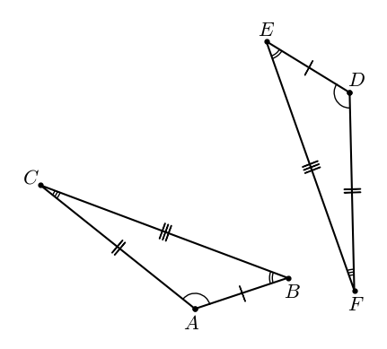

#   Triangles and congruence (Triángulos y congruencia)

## Triangle angles sum (Suma de los ángulos de un triángulo)
[Ch04_S01](https://www.ck12.org/reader/reader-index.html#section/2932940/4.1/9549314)

(Ángulos interiores de un polígono)
**Interior angles of a polygon**: each of the angles at any of the vertices of the polygon, that is inside the polygon.
[Interior angles of a polygon image code](Programs/Ch04/S01_01_Interior_angles_of_a_polygon_image.py)

*Interior angles of a polygon*

The angle $\angle A$ is an interior angle of the polygon. Each vertex has an interior angle.

(Teorema de la suma de los ángulos interiores de un triángulo)
**Triangle interior angles sum theorem**: the sum of the interior angles of a triangle, is exactly $\pi$.
[Triangle interior angles sum image code](Programs/Ch04/S01_02_Triangle_interior_angles_sum_image.py)

*Triangle interior angles sum*

> Proof of the triangle interior angles sum theorem
>
> | Statement                                      | Reason                   |
> | :--------------------------------------------: | :----------------------: |
> | The $\triangle ABC$ exists, and $\overleftrightarrow{CD} \parallel \overline{AB}$ | Given |
> | $\angle 1 \cong \angle 4$ and $\angle 2 \cong \angle 5$ | Alternate interior angles theorem |
> | $m \angle 1 = m \angle 4$ and $m \angle 2 = m \angle 5$ | Definition of congruence |
> | $m \angle 4 + m \angle ACD = \pi$ | Linear pair postulate |
> | $m \angle ACD = m \angle 3 + m \angle 5$ | Angle addition postulate |
> | $m \angle 4 + m \angle 3 + m \angle 5 = \pi$ | Substitution property of equality |
> | $m \angle 1 + m \angle 3 + m \angle 2 = \pi$ | Substitution property of equality |
> | $m \angle 1 + m \angle 2 + m \angle 3 = \pi$ | Commutative property of addition |

(Ángulos exteriores de un polígono)
**Exterior angles of a polygon**: each of the angles at any of the vertices of the polygon, that is outside the polygon, formed by a side of the vertex and the extension of the other side.
[Exterior angles of a polygon image code](Programs/Ch04/S01_03_Exterior_angles_of_a_polygon_image.py)

*Exterior angles of a polygon*

The angle $\angle B$ is an exterior angle of the polygon. Given that each vertex in a polygon has two sides, two exterior angles can be drawn from each vertex, both being congruent to each other due to the vertical angles theorem.

In a given vertex of a polygon, the interior angle and one exterior angle (any of the two) form a linear pair, which means they are supplementary.

(Teorema de la suma de los ángulos exteriores de un triángulo)
**Triangle exterior angle sum theorem**: the sum of the exterior angles of a triangle is exactly $2\pi$, taking only one exterior angle per vertex.
[Triangle exterior angle sum image code](Programs/Ch04/S01_04_Triangle_exterior_angle_sum_image.py)

*Triangle exterior angle sum*

> Proof of the triangle exterior angle sum theorem
>
> | Statement                                      | Reason                   |
> | :--------------------------------------------: | :----------------------: |
> | $m \angle 1 + m \angle 2 + m \angle 3 = \pi$ | Triangle interior angles sum theorem |
> | $m \angle 1 + m \angle 4 = \pi$, $m \angle 2 + m \angle 5 = \pi$, and $m \angle 3 + m \angle 6 = \pi$ | Linear pair postulate |
> | $m \angle 1 = \pi - m \angle 4$, $m \angle 2 = \pi - m \angle 5$, and $m \angle 3 = \pi - m \angle 6$ | Subtraction property of equality |
> | $\pi - m \angle 4 + \pi - m \angle 5 + \pi - m \angle 6 = \pi$ | Substitution property of equality |
> | $3 \pi - \pi = m \angle 4 + m \angle 5 + m \angle 6$ | Subtraction property of equality (for $\pi$), addition property of equality (for the angles), and commutative property of addition (to add the $\pi$s) |
> | $m \angle 4 + m \angle 5 + m \angle 6 = 2 \pi$ | Reflexive property of equality |

(Ángulos interiores remotos)
**Remote interior angles**: the angles that are not adjacent to a given exterior angle. In a triangle, given an exterior angle, the remote interior angles are the two interior angles that are not adjacent to said exterior angle.
[Remote interior angles image code](Programs/Ch04/S01_05_Remote_interior_angles_image.py)

*Remote interior angles*

In the triangle $\triangle ABC$, the marked angle $\angle DAC$ is an exterior angle, its two remote interior angles are $\angle B$ and $\angle C$.

(Teorema del ángulo exterior)
**Exterior angle theorem**: in a triangle, the measure of an exterior angle is equal to the sum of the measures of its two remote interior angles.

> Proof of the exterior angle theorem
>
> | Statement                                      | Reason                   |
> | :--------------------------------------------: | :----------------------: |
> | The angle $\angle DAC$ is an exterior angle, and the angles $\angle B$ and $\angle C$ are the remote interior angles relative to $\angle DAC$ | Given |
> | $m \angle A + m \angle B + m \angle C = \pi$ | Triangle interior angles sum theorem |
> | $m \angle A + m \angle DAC = \pi$ | Linear pair postulate |
> | $m \angle A + m \angle DAC = m \angle A + m \angle B + m \angle C$ | Transitive property of equality |
> | $m \angle DAC = m \angle B + m \angle C$ | Subtraction property of equality |

## Congruent figures (Figuras congruentes)
[Ch04_S02](https://www.ck12.org/reader/reader-index.html#section/2932941/4.2/9549314)

(Triángulos congruentes)
**Congruent triangles**: given two triangles, they are congruent if they have their corresponding sides congruent and their corresponding angles congruent.
[Congruent triangles images code](Programs/Ch04/S02_01_Congruent_triangles_image.py)

*Congruent triangles*

The triangle $\triangle ABC$ is congruent to the triangle $\triangle DEF$, because their corresponding sides are congruent and also their corresponding angles are congruent.

> Triangle congruence
>
> The congruence $\triangle ABC \cong \triangle DEF$, because $\overline{AB} \cong \overline{DE}$, $\overline{AC} \cong \overline{DF}$, $\overline{BC} \cong \overline{EF}$, $\angle A \cong \angle D$, $\angle B \cong \angle E$, and $\angle C \cong \angle F$.

In the statement $\triangle ABC \cong \triangle DEF$ the order of the vertices follows the congruence.

(Teorema del tercer ángulo)
**Third angle theorem**: given two triangles, if two pairs of angles are congruent, then the third pair of angles is congruent.

> Proof of the third angle theorem
>
> | Statement                                      | Reason                   |
> | :--------------------------------------------: | :----------------------: |
> | The triangles $\triangle ABC$ and $\triangle DEF$, have $\angle A \cong \angle D$ and $\angle B \cong \angle E$ | Given |
> | $m \angle A = m \angle D$, $m \angle B = m \angle E$ | Definition of congruence |
> | $m \angle A + m \angle B + m \angle C = \pi$, $m \angle D + m \angle E + m \angle F = \pi$ | Triangle interior angles sum theorem |
> | $m \angle A + m \angle B + m \angle C = m \angle D + m \angle E + m \angle F$ | Transitive property of equality |
> | $m \angle A + m \angle B + m \angle C = m \angle A + m \angle B + m \angle F$ | Substitution property of equality |
> | $m \angle C = m \angle F$ | Subtraction property of equality |
> | $\angle C \cong \angle F$ | Definition of congruence |

## Triangle congruence criteria 1 (Criterios de congruencia de triángulos 1)
[Ch04_S03](https://www.ck12.org/reader/reader-index.html#section/6707215/4.3/9549314)

## Triangle congruence criteria 2 (Criterios de congruencia de triángulos 2)
[Ch04_S04](https://www.ck12.org/reader/reader-index.html#section/2932943/4.4/9549314)

## Isosceles and equilateral triangles (Triángulos isósceles y equiláteros)
[Ch04_S05](https://www.ck12.org/reader/reader-index.html#section/6042181/4.5/9549314)