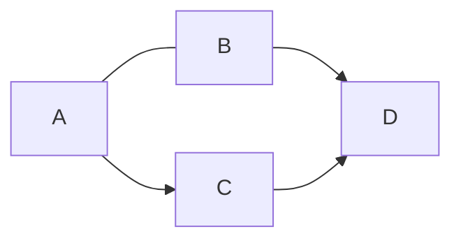
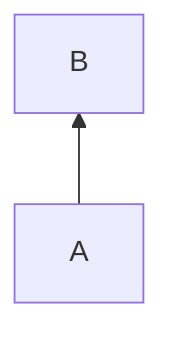

<!--
#   Mermaid and SMILES
-->

<!-- #T# Table of contents -->

<!-- #C# Mermaid -->
<!-- #C# SMILES -->

<!-- #T# Beginning of content -->

<!-- #C# Mermaid -->

<!-- # |------------------------------------------------------------- -->
<!-- #T# Mermaid is used in Markdown to create diagrams such as graphs, pie charts, Gantt diagram, flowcharts, class diagrams, entity relationship diagrams, etcetera -->

<!-- #T# Pandoc can be used to render Mermaid diagrams in HTML and PDF files, this needs the use of an external Pandoc filter, such as the `mermaid-filter` filter -->

<!-- #T# to use Mermaid in Markdown, the code block is used, using the word 'mermaid' as the language of the code block -->

<!-- #T# the first word after mermaid is , this word determines the type of diagram, 'graph' is to make flowcharts, it can also be 'pie' for a pie chart, 'gantt' for a Gantt diagram, 'stateDiagram' for a state diagram, 'classDiagram' for a class diagram, 'erDiagram' for an entity relationship diagram, 'sequenceDiagram' for a sequence diagram, each with its own syntax -->

<!-- #T# Mermaid code can be written in its own file, and it can be compiled into SVG using the `mmdc` command, which is the Mermaid CLI -->

<!-- #T# the `mmdc` command has the following basic syntax -->
<!-- # SYNTAX `mmdc -i input_file1.mmd -o output_file1.svg`{.bash} -->
<!-- #T# the file output_file1.svg contains the image form of the Mermaid diagram in input_file1.mmd -->

<!-- #T# to put a caption to the image, the `caption` attribute can be used -->
``` {.mermaid caption="image_caption1" format="svg"}
graph TB
    A-->B
```

<!-- #T# in a 'graph' diagram, LR stands for left to right, but it can be replaced with TB which stands for top to bottom, these letters can be reversed -->

<!-- # |------------------------------------------------------------- -->

<!-- #C# SMILES -->

<!-- # |------------------------------------------------------------- -->
<!-- #T# SMILES stands for Simplified Molecular Input Line Entry System, it is used in Markdown to convert plain text into 2D molecular diagrams -->

<!-- #T# to use SMILES in Markdown, a code block is used, using the word 'smiles' as the language of the code block (it may require a Mathpix SMILES extension or compiler to see the molecule) -->
```smiles
O=C=O
```
<!-- #T# this shows a carbon dioxide molecule -->
<!-- # |------------------------------------------------------------- -->