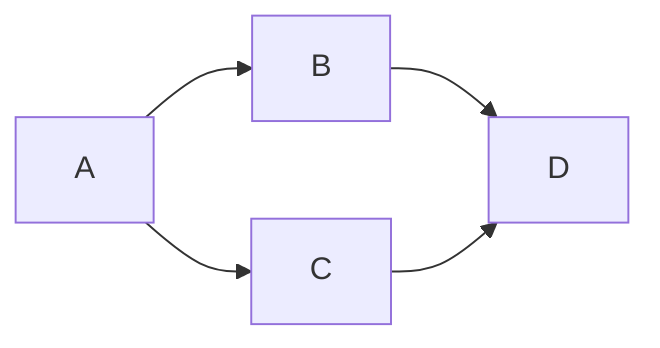

<!--
    Mermaid and SMILES
-->

<!-- #T# Table of contents -->

<!-- #C# Mermaid -->
<!-- #C# SMILES -->

<!-- #T# Beginning of content -->

<!-- #C# Mermaid -->

<!-- # |------------------------------------------------------------- -->
<!-- #T# Mermaid is used in Markdown to create diagrams such as graphs, pie charts, Gantt diagram, flowcharts, class diagrams, entity relationship diagrams, etcetera -->

<!-- #T# to use Mermaid in Markdown, the triple backtick fence is used, using the word 'mermaid' as the language of the fence -->

<!-- #T# the first word after mermaid is 'graph', this word determines the type of diagram, it can also be 'pie' for a pie chart, 'gantt' for a Gantt diagram, 'classDiagram' for a class diagram, 'erDiagram' for an entity relationship diagram, each with its own syntax -->

<!-- #T# in a 'graph' diagram, LR stands for left to right, but it can be replaced with TD which stands for top down, these letters can be reversed, flowcharts are made with this type of diagram -->
<!-- # |------------------------------------------------------------- -->

<!-- #C# SMILES -->

<!-- # |------------------------------------------------------------- -->
<!-- #T# SMILES stands for Simplified Molecular Input Line Entry System, it is used in Markdown to convert plain text into 2D molecular diagrams -->

<!-- #T# to use SMILES in Markdown, the triple backtick fence is used, using the word 'smiles' as the language of the fence (it may require a Mathpix SMILES extension or compiler to see the molecule) -->
```smiles
O=C=O
```
<!-- #T# this shows a carbon dioxide molecule -->
<!-- # |------------------------------------------------------------- -->