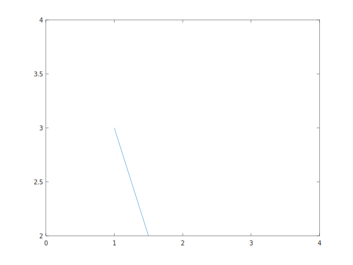

<!-- 
    Basic syntax
-->

<!-- #T# Table of contents -->

<!-- #T# Normal text -->
<!-- #T# Headings -->
<!-- #T# Simple text formatting -->
<!-- #T# Bulleted lists -->
<!-- #T# Anchors, links -->
<!-- #T# Blockquotes -->
<!-- #T# Source code -->
<!-- #T# Equations -->

<!-- #T# Beginning of content -->

<!-- #T# render a Markdown file as an HTML file using the Markdown+Math extension, in the command palette of VS Code select the command "Markdown: Save Markdown+Math to HTML", this saves the file as an HTML file in the same dir. Convert from HTML to PDF using Firefox, for example -->

<!-- #T# Normal text -->

<!-- #T# normal text is written without any special syxtax -->
Normal text, normal text.

<!-- #T# Headings -->

<!-- #T# headings start with the hash symbol, up to 6 -->
# Heading1
## Heading2
###### Heading6

<!-- #T# Simple text formatting -->

<!-- #T# bold text is written within double asterisks or double underscore -->
Normal text **bold text** continue normal __bold text two.__

<!-- #T# italic text is written within single asterisks or single underscore -->
Normal text *italic text* continue normal _italic text two._

<!-- #T# strikethrough text is written within double tildes -->
~~strikethrough text~~

<!-- #T# Bulleted lists -->

<!-- #T# make ordered lists with any number and a dot -->
1. item1
    1. subitem1
        1. subsubitem1
        1. subsubitem2
    1. subitem2
1. item2
1. item3

<!-- #T# make unordered lists with asterisks, plus or minus -->
* item
    + subitem
        - subsubitem
            * subsubsubitem
+ item

<!-- #T# Anchors, links -->

<!-- #T# create anchors to links -->
<!-- # [anchor_text1](hyperlink1) -->
[anchor to Duckduckgo](https://duckduckgo.com/)

<!-- #T# embed images with an anchor but starting with an exclamation mark -->
<!-- #  -->


<!-- #T# Blockquotes -->

<!-- #T# create a blockquote by starting each line in the block with the greater than symbol -->
> Text in the blockquote is
> commonly for related content

<!-- #T# Source code -->

<!-- #T# one liner code goes within backticks -->
`line_of_code = 1`

<!-- #T# fence multi line code within 3 backticks -->
```C
    if(line_of_code == 1)
    {
        print("str1");
    }
```
<!-- #T# Equations -->

<!-- #T# equations can be written, using Latex syntax -->

<!-- #T# inline equations are enclosed in single dollar signs -->
Inline $x = 3$ equation

<!-- #T# whole line equations are enclosed in double dollar signs, the equation numbering can be set in parentheses after the double dollar signs -->
$$\alpha A\pm\sqrt{x} \over y^{2}$$ (1)